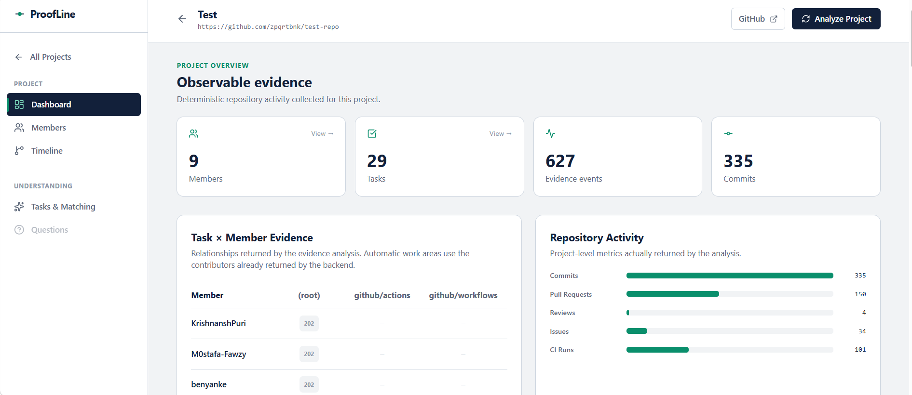

# ProofLine

**Turning Student Team GitHub Activity into Transparent Contribution Evidence and Proof of Understanding**

<p align="center">
  
  
  
  
  
  
  
  
</p>

ProofLine analyzes observable GitHub activity to help instructors review student team projects. It combines deterministic evidence collection with optional LLM-assisted explanations and evidence-grounded checks of student understanding.

> **Core principle:** GitHub activity is not the same as contribution, and contribution is not the same as understanding.

## Table of Contents

- [Overview](#overview)
- [The Problem](#the-problem)
- [How ProofLine Solves It](#how-proofline-solves-it)
- [Screenshots](#screenshots)
- [Technology Stack](#technology-stack)
- [How It Works](#how-it-works-end-to-end)
- [The LLM Layer](#the-llm-layer-openrouter)
- [Project Structure](#project-structure)
- [Backend Setup and Run](#backend-setup-and-run)
- [Frontend Setup and Run](#frontend-setup-and-run)
- [API Reference](#api-reference)
- [Analysis Output](#analysis-output)
- [Design Principles and Limitations](#design-principles-and-limitations)
- [Privacy and Responsible Use](#privacy-and-responsible-use)
- [Troubleshooting](#troubleshooting)
- [Contributing](#contributing)
- [License](#license)
- [Disclaimer](#disclaimer)

---

## Overview

ProofLine is a full-stack web application that turns raw GitHub activity into transparent, verifiable evidence for student team projects. It also provides an optional **Proof of Understanding** workflow that asks students to explain work associated with their observable repository activity.

The primary audience is professors and instructors evaluating team projects in which several students collaborate in one GitHub repository. GitHub records events, but those events do not automatically explain the nature, context, or understanding behind the work. ProofLine organizes the available evidence, explains what it can and cannot support, and helps instructors investigate further.

ProofLine is **not** a plagiarism detector, a definitive authorship detector, or a contribution-percentage calculator. Its deterministic analysis is the source of truth; an LLM can help interpret that evidence but cannot replace it.

## The Problem

Consider a professor evaluating a group project with four students working in the same repository. The professor may need to investigate questions such as:

- Did each student leave observable evidence of work?
- Which work areas did students touch: backend code, machine-learning artifacts, documentation, tests, or configuration?
- Did students review or discuss each other's work?
- Does a high commit count represent separate work items or many small commits inside one pull request?
- Which files, pull requests, and commits support a task-to-member match?
- Can a student explain the code or artifact associated with their work?
- How can an instructor review the repository without manually reading its entire history?

GitHub provides commits, pull requests, reviews, comments, file changes, issues, and workflow activity. It does not automatically turn those records into a careful, contextual explanation.

### Why simple metrics can mislead

| Naive metric | Why it can be misleading |
|---|---|
| Total commit count | Many tiny commits can outnumber fewer substantial changes. |
| Lines added | Added and deleted lines do not directly measure effort or value. |
| Last person to edit a file | A small correction does not establish ownership of the whole file. |
| Contribution percentage | Git activity alone cannot establish a reliable real-world contribution percentage. |
| Activity equals effort | Planning, debugging, pair programming, and offline work may not appear in the repository. |
| File touched equals understanding | A changed file does not prove that the person understands its implementation. |

GitHub Classroom helps distribute assignments and collect repositories, but instructors may still need to interpret repository activity manually.

## How ProofLine Solves It

### 1. Turns repository events into evidence chains

ProofLine collects supported repository information from the GitHub REST API, including commits, pull requests, changed files, reviews, review comments, PR commits, issues, issue comments, repository events, and workflow runs where available.

Collected information is normalized into events. A **pull request is treated as the primary work unit**: commits, reviews, and merges describe its progression rather than automatically becoming separate work units. Duplicate representations of the same commit are deduplicated where supported by the analysis pipeline.

This helps prevent a large number of small commits inside one pull request from being interpreted as the same number of independent work items.

### 2. Classifies file types instead of merely counting files

Changed files are grouped into categories:

- `code`
- `documentation`
- `configuration`
- `model`
- `data`
- `dependency`
- `asset`
- `other`

Machine-learning artifacts such as `.pkl`, `.pt`, `.onnx`, `.h5`, and `.safetensors` may represent meaningful work even when they do not contain conventional source-code lines. Documentation, tests, configuration, and dependency files can also be legitimate parts of a project.

File categories describe observable repository activity. They do not establish intellectual ownership or prove who designed, trained, or understood a model.

### 3. Uses qualitative evidence status

ProofLine uses qualitative evidence levels such as **LOW**, **MEDIUM**, and **HIGH**, rather than presenting a percentage as a definitive measure of contribution.

The evidence level is derived from configured rules and available signals, such as direct work, changed files, corroborating pull-request activity, and sustained activity. The exact result depends on which events were collected and how they relate.

- **HIGH** can indicate multiple corroborating kinds of observable evidence.
- **MEDIUM** can indicate direct work with more limited corroboration.
- **LOW** can indicate limited or indirect evidence, or no collected events.

These levels describe the strength of the available evidence, not the student's worth, effort, grade, or total contribution.

### 4. Connects tasks to observable repository work

An instructor can define tasks with a name, description, and file patterns such as `backend/auth/*`. When tasks are not manually provided, ProofLine can generate candidate work areas from repository paths.

Task matching first identifies candidate member–task pairs from observable file activity. The LLM can then help interpret those candidates using a constrained format, for example:

- **ALIGNED** — the available evidence supports a clear relationship to the task.
- **PARTIAL** — the evidence suggests a limited or indirect relationship.

A match should include a reason and relevant files when available so an instructor can verify the result. A match is not proof that the student completed the entire task independently.

### 5. Adds a Proof of Understanding workflow

Observable activity does not prove understanding. ProofLine can generate questions for a selected member that are grounded in repository evidence, such as real file paths, commit SHAs, pull-request numbers, or configured tasks.

The student answers the questions, and the LLM evaluates the answers against the available evidence. The result can include per-question feedback, reference answers, an overall summary, strengths, areas to improve, and advice.

The system validates output and can use deterministic fallback behavior if an LLM response cannot be parsed. LLM-generated evaluations should still be reviewed by a human, especially when used in academic decisions.

### 6. Makes limitations explicit

ProofLine distinguishes observation from interpretation:

- It says **“no observable GitHub activity”**, not “the student did no work.”
- A changed file indicates observable repository activity, not intellectual ownership.
- Activity indicators are not grades, ownership percentages, or measures of understanding.
- Commit messages, PR titles, and file names are treated as untrusted data, not instructions to the model.

## Screenshots

Add actual screenshots to `docs/screenshots/` and update the paths below. These are suggested screenshot slots, not images included in this repository.

```text
docs/
└── screenshots/
    ├── 01-landing.png
    ├── 02-create-project.png
    ├── 03-dashboard.png
    ├── 04-member-detail.png
    ├── 05-timeline.png
    ├── 06-task-matching.png
    └── 07-understanding-check.png
```

Example Markdown:

```md

```

## Technology Stack

Documentation links below open the official documentation for each technology.

### Backend

| Layer | Technology | Documentation |
|---|---|---|
| Language | Python 3.10+ | [Python documentation](https://docs.python.org/3/) |
| Web framework | FastAPI | [FastAPI documentation](https://fastapi.tiangolo.com/) |
| ASGI server | Uvicorn | [Uvicorn documentation](https://www.uvicorn.org/) |
| ORM | SQLAlchemy | [SQLAlchemy documentation](https://docs.sqlalchemy.org/) |
| Data validation and settings | Pydantic | [Pydantic documentation](https://docs.pydantic.dev/latest/) |
| Settings management | pydantic-settings | [pydantic-settings documentation](https://docs.pydantic.dev/latest/concepts/pydantic_settings/) |
| Database | SQLite | [SQLite documentation](https://www.sqlite.org/docs.html) |
| Async HTTP client | HTTPX | [HTTPX documentation](https://www.python-httpx.org/) |
| API documentation | OpenAPI / Swagger UI | [FastAPI interactive docs](https://fastapi.tiangolo.com/features/#automatic-docs) |

### Frontend

| Layer | Technology | Documentation |
|---|---|---|
| UI library | React | [React documentation](https://react.dev/) |
| Build tool and development server | Vite | [Vite documentation](https://vite.dev/guide/) |
| Routing | React Router | [React Router documentation](https://reactrouter.com/) |
| HTTP client | Axios | [Axios documentation](https://axios-http.com/docs/intro) |
| Styling | Tailwind CSS | [Tailwind CSS documentation](https://tailwindcss.com/docs) |
| Icons | Lucide React | [Lucide React documentation](https://lucide.dev/guide/packages/lucide-react) |
| Charts | Recharts | [Recharts documentation](https://recharts.org/en-US/guide) |
| Linting | Oxlint | [Oxlint documentation](https://oxc.rs/docs/guide/usage/linter.html) |

### External services

| Service | Purpose | Documentation |
|---|---|---|
| GitHub REST API | Repository and collaboration evidence | [GitHub REST API documentation](https://docs.github.com/en/rest) |
| OpenRouter | Access to supported LLMs through one API | [OpenRouter documentation](https://openrouter.ai/docs) |

> **Version note:** The versions shown in the project badges and dependency files may change. The installed dependency files are the source of truth for the versions used in a particular checkout.

## How It Works (End to End)

### Step 1 — Create a project

The frontend submits a project name and GitHub repository URL to `POST /projects`.

The backend parses the repository owner and name, retrieves available contributors, creates the project and member records, and stores any manually supplied tasks. GitHub's contributor counts are observable repository data; they are not ProofLine contribution percentages.

### Step 2 — Analyze the repository

The frontend calls `POST /projects/{id}/analyze`.

At a high level, the analysis pipeline:

1. Collects repository metadata and supported activity from GitHub.
2. Fetches pull-request details, including changed files and collaboration events where available.
3. Enriches selected commits with file and change information.
4. Normalizes collected data into events and attributes events to declared project members where possible.
5. Stores the collected events.
6. Runs deterministic evidence and timeline analysis.
7. Serializes and stores the analysis result.

Some GitHub endpoints may fail because of permissions, rate limits, unavailable data, or network issues. Optional collection should be treated as incomplete when warnings or limitations are reported.

### Step 3 — Explore the project

The interface can present project-level and member-level views such as:

- Project summary and observable activity indicators.
- Task-by-member evidence matrix.
- File-type activity.
- Repository and member timelines.
- Member details, changed files, commits, pull requests, and patterns.
- Evidence graph and evidence associated with a task.
- Entry points for task matching and understanding checks.

The precise content depends on the collected repository evidence and the features available in the current frontend.

### Step 4 — Generate and match tasks

The LLM endpoints can generate candidate tasks, match members to tasks based on deterministic candidate evidence, and create an explanation of the available evidence. The combined endpoint can run these operations together.

Generated tasks are inferred work areas, not guaranteed to represent the instructor's original assignment plan.

### Step 5 — Check understanding

ProofLine can create an understanding-check session for a member, generate questions tied to available evidence, and evaluate the member's answers. Evaluation results should be interpreted with the question, supporting evidence, and any reported limitations.

## The LLM Layer (OpenRouter)

### Why OpenRouter?

ProofLine uses OpenRouter to access supported language models through an OpenAI-compatible chat-completions interface. The selected model can be changed through configuration, subject to OpenRouter availability and the application's implementation.

- Model selection can be configured without changing the evidence engine.
- Model cost, speed, and output quality depend on the selected provider and model.
- An API key is required for LLM features.

Official documentation: [OpenRouter API quickstart](https://openrouter.ai/docs/quickstart).

### LLM responsibilities

| Role | Endpoint | Purpose |
|---|---|---|
| Task generation | `/llm/projects/{id}/tasks/generate` | Propose candidate tasks and file patterns |
| Task matching | `/llm/projects/{id}/tasks/match` | Interpret deterministic member–task candidates |
| Final explanation | `/llm/projects/{id}/explain` | Produce a readable explanation of the analysis |
| Understanding check | `/llm/projects/{id}/members/{mid}/understanding/...` | Generate questions and evaluate answers |

### Prompt and evidence safeguards

The LLM layer is intended to follow these rules:

- The deterministic evidence package is the source of truth.
- It must not invent people, files, dates, commits, or numbers.
- Repository text such as commit messages and PR titles is untrusted input.
- It must not turn activity into a real-world contribution percentage.
- A changed file does not prove intellectual ownership.
- Missing GitHub activity does not prove missing work.
- Documentation, configuration, and model files may be legitimate work.
- Concerns should be phrased as observations or points to verify, not accusations.
- Structured responses are validated, and fallback behavior is used where implemented.

### Reliability and fallback behavior

LLM responses can be malformed, incomplete, or unavailable. The backend may attempt to parse or repair structured output, retry eligible failures, reduce payload size, or use deterministic fallbacks where implemented. These fallbacks improve availability but do not make an LLM-generated result equivalent to a human assessment.

## Project Structure

The exact structure can differ between branches. The following is a **conceptual guide** to the main backend and frontend areas; adjust it to match the repository's actual files before publishing.

```text
proofline/
├── app/
│   ├── main.py
│   ├── api/
│   ├── models/
│   ├── schemas/
│   ├── services/
│   └── core/
├── frontend/
│   ├── src/
│   │   ├── components/
│   │   ├── pages/
│   │   ├── services/
│   │   └── ...
│   ├── package.json
│   └── vite.config.js
├── docs/
│   └── screenshots/
├── .env.example
├── requirements.txt
├── README.md
└── LICENSE
```

## Backend Setup and Run

### Prerequisites

- Python 3.10 or later.
- Git.
- A GitHub Personal Access Token is strongly recommended for repeated or detailed repository analysis.
- An OpenRouter API key is required for LLM features.
- Access to the GitHub repository you want to analyze.

### 1. Clone the repository

Replace the placeholder with the actual repository URL:

```bash
git clone <your-repository-url>
cd proofline
```

### 2. Create and activate a virtual environment

**Windows PowerShell:**

```powershell
py -m venv .venv
.\.venv\Scripts\Activate.ps1
```

**Windows Command Prompt:**

```bat
py -m venv .venv
.venv\Scripts\activate.bat
```

**Linux / macOS:**

```bash
python3 -m venv .venv
source .venv/bin/activate
```

### 3. Install Python dependencies

```bash
python -m pip install --upgrade pip
pip install -r requirements.txt
```

### 4. Configure environment variables

Copy the example environment file if the repository includes one.

**Windows PowerShell:**

```powershell
Copy-Item .env.example .env
```

**Linux / macOS:**

```bash
cp .env.example .env
```

Edit `.env` and use the variable names supported by your application's settings. A typical configuration may look like this:

```env
APP_NAME=ProofLine
DATABASE_URL=sqlite:///./proofline.db
GITHUB_API_URL=https://api.github.com
GITHUB_TOKEN=YOUR_GITHUB_TOKEN_HERE

LLM_ENABLED=true
OPENROUTER_API_KEY=YOUR_OPENROUTER_API_KEY_HERE
OPENROUTER_MODEL=openai/gpt-4o-mini
OPENROUTER_API_URL=https://openrouter.ai/api/v1
OPENROUTER_REFERER=http://localhost:5173
OPENROUTER_TITLE=ProofLine
```

**Important:** Check `.env.example` and your settings code for the exact supported variable names before running the application. Do not commit `.env` or publish API keys.

#### GitHub token

Unauthenticated GitHub API requests have stricter rate limits. Analysis can make many API requests, so a token is strongly recommended. Grant only the permissions needed for the repositories you intend to analyze. Private repository access requires appropriate authorization.

#### OpenRouter model

`OPENROUTER_MODEL` must be a model identifier supported by OpenRouter and compatible with the application's request format. Check the [OpenRouter models page](https://openrouter.ai/models) for current options. Availability, pricing, and model names can change.

### 5. Start the backend

From the directory containing the `app` package, run:

```bash
uvicorn app.main:app --reload --port 8000
```

When startup succeeds, the local API is typically available at:

- API base: `http://localhost:8000`
- Swagger UI: `http://localhost:8000/docs`
- ReDoc: `http://localhost:8000/redoc`

If the project implements the database status endpoint, it may also be available at `http://localhost:8000/database-status`.

Database tables may be created automatically on startup if the application's startup configuration is set up to do so.

## Frontend Setup and Run

### Prerequisites

- Node.js version supported by the installed Vite version. For Vite 8, consult the [Vite getting-started guide](https://vite.dev/guide/).
- npm.

### 1. Enter the frontend directory

From the repository root:

```bash
cd frontend
```

### 2. Install dependencies

```bash
npm install
```

### 3. Configure the API URL (if needed)

If the frontend reads its API base URL from `VITE_API_URL`, create `frontend/.env`:

```env
VITE_API_URL=http://localhost:8000
```

Use the variable name expected by the frontend's API client. Vite exposes client-side environment variables prefixed with `VITE_`; do not put secrets in frontend environment variables.

### 4. Start the development server

```bash
npm run dev
```

Vite commonly serves the app at `http://localhost:5173`. Use the URL printed in the terminal if a different port is selected.

### Run both services

Open two terminals.

**Terminal 1 — backend, from the backend project root:**

```bash
uvicorn app.main:app --reload --port 8000
```

**Terminal 2 — frontend:**

```bash
cd frontend
npm run dev
```

Open the frontend URL printed by Vite. If the frontend runs on a different origin, make sure the backend CORS configuration allows that origin.

## API Reference

The following table documents the endpoints described by the current project specification. Confirm request bodies, response schemas, and authentication requirements in Swagger UI at `/docs`, because those details depend on the implementation.

### Projects (`/projects`)

| Method | Path | Description |
|---|---|---|
| `POST` | `/projects` | Create a project with members and manually supplied tasks |
| `GET` | `/projects/{id}` | Get project details, contributors, and tasks |
| `POST` | `/projects/{id}/analyze` | Run the deterministic analysis pipeline |
| `GET` | `/projects/{id}/analysis` | Get the latest stored analysis JSON |
| `GET` | `/projects/{id}/analyses` | List analysis runs with IDs and creation timestamps |
| `GET` | `/projects/{id}/members/{member_id}` | Get a single member's summary |
| `GET` | `/projects/{id}/evidence-graph` | Get the evidence graph, including nodes and edges |
| `GET` | `/projects/{id}/tasks/{task_id}/evidence` | Get evidence associated with one task |
| `GET` | `/projects/{id}/timeline?limit=200` | Get the project timeline |
| `GET` | `/projects/{id}/members/{member_id}/timeline` | Get one member's timeline |
| `GET` | `/projects/{id}/contributions` | Get observable activity indicators |

### LLM (`/llm`)

| Method | Path | Description |
|---|---|---|
| `POST` | `/llm/projects/{id}/tasks/generate?regenerate=true` | Generate candidate tasks from repository evidence |
| `POST` | `/llm/projects/{id}/tasks/match` | Match members to tasks using available evidence |
| `POST` | `/llm/projects/{id}/explain` | Generate a readable explanation of the analysis |
| `POST` | `/llm/projects/{id}/run?regenerate_tasks=true` | Run task generation, matching, and explanation |
| `POST` | `/llm/projects/{id}/members/{mid}/understanding/questions` | Create an understanding-check session and questions |
| `POST` | `/llm/projects/{id}/members/{mid}/understanding/{sid}/evaluate` | Evaluate answers for an understanding-check session |

### API documentation

- [FastAPI Swagger UI](http://localhost:8000/docs) — interactive endpoint exploration and request testing.
- [FastAPI ReDoc](http://localhost:8000/redoc) — alternative API reference.

These local links work when the backend is running on your machine.

## Analysis Output

The `analysis_json` field stores the deterministic analysis and, when the relevant LLM operations have run, enriched results.

The snapshot may contain:

- `member_analysis`
- `task_analysis`
- `evidence_chains`
- `evidence_graph`
- `patterns`
- `timeline`
- `collection`
- `repository`
- `tasks`
- `llm`
- `limitations`
- `task_member_matching` — when task matching has run
- `llm_analysis` — when the LLM explanation has run

The fields available depend on the analysis stage and which optional LLM operations have completed. Treat reported collection warnings and limitations as part of the result, not as incidental metadata.

## Design Principles and Limitations

### Design principles

1. **Deterministic evidence is the source of truth.** The LLM explains evidence; it does not replace it.
2. **Pull requests are the primary work unit.** Commits, reviews, and merges describe the PR's progression.
3. **No invented percentages.** Evidence status is qualitative (`LOW`, `MEDIUM`, `HIGH`).
4. **File kind matters.** Model artifacts, documentation, data, and configuration can all be relevant.
5. **Repository content is untrusted data.** Text inside commits, PRs, and files must not override system instructions.
6. **Absence of evidence is not evidence of absence.** Report no observable activity rather than claiming that no work occurred.
7. **Graceful degradation.** Deterministic results and fallbacks should remain available when LLM features fail, where implemented.
8. **Results should be verifiable.** Matches should point to relevant files, commit SHAs, and PR numbers when available.

### Limitations

- The timeline reflects observable GitHub activity, not all work performed by a team.
- No observable GitHub activity does not prove that a person did no work.
- GitHub timestamps may differ from when work actually happened.
- Timeline phases, when shown as equal time slices, are not declared project milestones.
- Activity patterns are observations to investigate, not conclusions about behavior.
- A pull request is treated as a work unit; commits, reviews, and merges describe its progression.
- Only declared project members receive member attribution; unknown GitHub actors may not be counted as project members.
- Model files show observable artifacts but do not prove who trained or designed the model.
- Manual task matching depends on declared file patterns; automatically discovered work areas are inferred from repository paths.
- The contribution indicator is a formula-based observable-activity weight, not a grade, ownership percentage, or measure of understanding.
- Task matches and activity indicators should be reviewed alongside the underlying evidence and any collection limitations.

## Privacy and Responsible Use

ProofLine is intended to support transparent review, not to make automatic judgments about a person's effort, ability, or honesty.

- Use evidence summaries as a starting point for discussion and verification.
- Allow students to explain work that is not visible in GitHub, including planning, pair programming, and offline work.
- Do not treat activity indicators as definitive rankings.
- Do not share private repository data or individual reports without appropriate authorization.
- Review generated explanations and understanding-check results before using them in academic evaluations.
- Follow the privacy, data-retention, and academic policies applicable to your institution.

## Troubleshooting

### GitHub returns `403` or rate-limit errors

- Configure a valid GitHub token in the backend environment.
- Confirm the token has access to the repository and the required permissions.
- Retry after the rate limit resets.
- Check the API response and application logs for the specific failure.

### LLM features fail

- Confirm that `LLM_ENABLED` is enabled if the application uses this setting.
- Confirm that `OPENROUTER_API_KEY` is valid and available to the backend.
- Verify that `OPENROUTER_MODEL` is a current model identifier supported by OpenRouter.
- Check the backend logs and the returned limitations or fallback indicators.
- Remember that deterministic analysis may work even when LLM features are unavailable.

### The frontend cannot reach the backend

- Make sure the backend is running on the configured port.
- Check `VITE_API_URL` or the frontend API client's configured base URL.
- Confirm the backend CORS configuration includes the frontend origin.
- Inspect the browser console and backend logs for the actual request error.

### No member or task match appears

- Check whether the repository activity was collected successfully.
- Confirm that the member is declared in the project and the GitHub login matches.
- For manually configured tasks, review the task's file patterns.
- Check the analysis output for collection warnings, missing evidence, and limitations.

## Contributing

Issues and pull requests are welcome.

When contributing, please preserve the core principles:

- Deterministic evidence remains the source of truth.
- The LLM remains an interpretation layer.
- Contribution percentages are never invented.
- Results remain traceable to observable evidence.
- Limitations and uncertainty are communicated clearly.
- Changes to event collection, deduplication, attribution, task matching, or scoring-like indicators include appropriate tests.

Before submitting a pull request, explain the purpose of the change and how it was tested.

## License

This project is intended to be released under the **MIT License**. Add a `LICENSE` file to the repository with the complete MIT License text and the correct copyright holder and year before distributing the project.

The MIT License permits use, copying, modification, distribution, sublicensing, and sale of copies, subject to its terms. It also includes the standard copyright and permission notice requirements and warranty/liability disclaimer.

For the official license text, see [The MIT License — Open Source Initiative](https://opensource.org/license/mit).

## Disclaimer

ProofLine provides evidence-based summaries of observable GitHub activity. It cannot establish the complete contribution, effort, authorship, or understanding of any team member.

Its results should support human review and discussion, not replace them. ProofLine should not be used as the sole basis for a student's grade or a definitive judgment about an individual's contribution.
